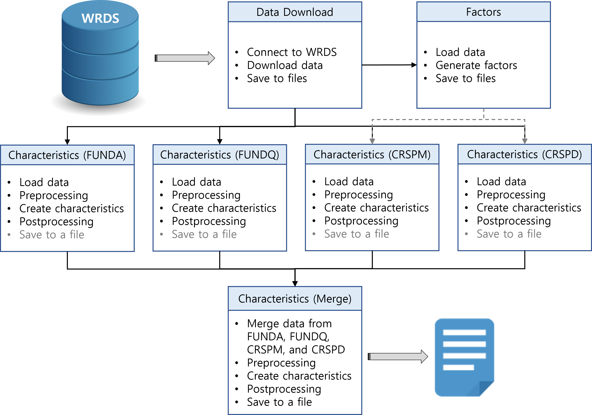

Installation
===============

You can install PyAnomaly either  using ``pip`` or from the source.
If you intend to use PyAnomaly ''as-is'', we recommend ``pip``.
If you need to refer to the source code frequently, e.g., to add new firm characteristics or functions,
you may want to have the source in your project directory.

* Using ``pip``

.. code-block::

    pip install pyanomaly

* From the source
    Download the source

Generating Characteristics
==========================

Process Flow
------------

A high-level process to generate firm characteristics is as follows.

#. Download data from WRDS and save them to files.
#. Generate factor portfolios: the factors will be used to generate firm characteristics based on factor regression.
#. Generate firm characteristics from each dataset (funda, fundq, crspm, crspd).
#. Merge the data and generate firm characteristics that require data from multiple datasets.
#. Save the result to a file.

It is worth noting that:

* Data need to be downloaded only once. The data are saved in files and can be loaded later to generate firm characteristics.
* The results can be saved in each step. This can save processing time when you test new characteristics.
  Consider a scenario where you add a new characteristic in ``FUNDA`` and need to generate it
  many times to validate the result. You can generate other firm characteristics only once and save them.
  Then, you can load them from files instead of generating them every time you generate the new characteristic.

Mapping File
------------

The `mapping file`_ defines the mapping between firm characteristics and functions, and functions and characteristic names
used in other papers. The file can be used to select the characteristics you want to generate and give them aliases.
A part of the file is shown below.

description
    This is a short description of the characteristics. When there are multiple versions of implementation, it is indicated
    in the description. For example, 'Idiosyncratic volatility (GHZ)' is GHZ's implementation of idiosyncratic volatility
    and 'Idiosyncratic volatility (Org, JKP)' is JKP's implementation. 'Org' indicates this version is closer to the
    original definition.

function
    This column shows the associated functions. If function is 'idiovol', the firm characteristic is implemented in
    the function ``c_idiovol()``: the actual function name always starts with ``c_``.
    If function is missing, it means the corresponding firm characteristic is not yet available.

ghz, jkp, hxz, cz
    These columns respectively show the aliases of the firm characteristics used in GHZ, JKP, HXZ, and CZ.
    If you set ``alias='ghz'`` when initializing ``Panel`` or its derived class, only the characteristics defined
    in 'ghz' column will be generated. Similarly, setting ``alias`` to 'jkp', 'hxz', or 'cz' will generate firm
    characteristics defined in these columns.
    If you set ``alias=None``, all available characteristics will be generated.

my chars
    You can add a new column in the file to define what characteristics to generate and their aliases.
    For example, if you add a column 'my chars' as shown in the table and set ``alias='my chars``, only
    'Idiosyncratic volatility (Org, JKP)' and 'Illiquidity' will be generated.

.. csv-table::
    :widths: 22, 20, 5, 5, 8, 8, 8, 8, 8, 8
    :header-rows: 1
    :file: mapping_example.csv

Output Files
------------

``Panel`` and its derived classes (``FUNDA``, ``FUNDQ``, ``CRSPM``, ``CRSPD``, and ``Merge``) have an attribute
``data``, which is a DataFrame that contains the raw data and the firm characteristics. An exception is ``CRSPD``,
which saves the firm characterisitcs in another attribute, ``chars``. This is because the raw data have a daily frequency,
whereas the firm characteristics have a monthly frequency.
The column names of the firm characteristics are their function names (without ``c_``). When ``data`` or ``chars``
is saved to a file by calling ``Panel.save()``, the column names will be replaced with the aliases.
When a saved file is loaded back to a class by calling ``Panel.load()``, the column names will be replaced with
the function names. In summary, the column names of the firm characteristics are the function names in ``data`` or ``chars``,
where as the column names are the aliases in saved files.

The easiest way to get started is going through examples.
The next section presents several examples to help you get familiarized with PyAnomaly.

